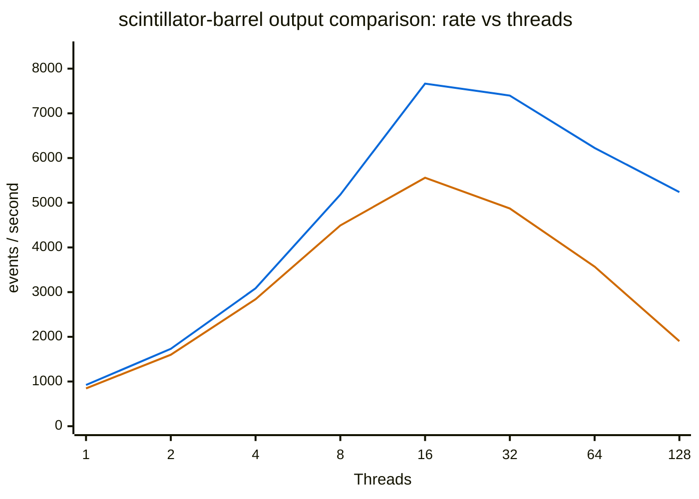

# Thread Scaling Results

## scintillator-barrel: no output

Runner configurations:

- 1 measurement job: AMD EPYC 9354 32-Core Processor; 64 OS physical cores, 2 threads/core, 2 sockets; linux 5.14.0-611.55.1.el9_7.x86_64; x64; 128 visible CPUs; pid 1449907's current affinity list: 0-127

| Threads | Median time | Std. dev. | Speedup | Efficiency | Effective serial | Median rate | Samples |
|---:|---:|---:|---:|---:|---:|---:|---:|
| 1 | 21.696 s | 0.076 s | 1.00x | 100.0% | — | 921.81 events/s | 4 |
| 2 | 11.550 s | 0.040 s | 1.88x | 93.9% | 6.5% | 1731.65 events/s | 4 |
| 4 | 6.485 s | 0.042 s | 3.35x | 83.6% | 6.5% | 3084.10 events/s | 4 |
| 8 | 3.861 s | 0.011 s | 5.62x | 70.3% | 6.0% | 5180.58 events/s | 4 |
| 16 | 2.609 s | 0.094 s | 8.32x | 52.0% | 6.2% | 7665.59 events/s | 4 |
| 32 | 2.704 s | 0.083 s | 8.02x | 25.1% | 9.6% | 7397.20 events/s | 4 |
| 64 | 3.213 s | 0.049 s | 6.75x | 10.6% | 13.5% | 6225.42 events/s | 4 |
| 128 | 3.818 s | 0.022 s | 5.68x | 4.4% | 16.9% | 5238.82 events/s | 4 |

> **Effective serial fraction:** Lower is better. This Amdahl/Karp–Flatt estimate approximates
> how much of the application's execution behaves serially. It also includes parallel overhead and
> contention, so it is not a literal percentage of source code.
> Negative values can result from superlinear scaling or measurement noise.

Per-replica sweeps (1)

| Replica | Runner | Threads | Median time | Speedup | Effective serial | Median rate |
|---:|:---|---:|---:|---:|---:|---:|
| 1 | AMD EPYC 9354 32-Core Processor; 64 OS physical cores, 2 threads/core, 2 sockets; linux 5.14.0-611.55.1.el9_7.x86_64; x64; 128 visible CPUs; pid 1449907's current affinity list: 0-127 | 1 | 21.696 s | 1.00x | — | 921.81 events/s |
|  |  | 2 | 11.550 s | 1.88x | 6.5% | 1731.65 events/s |
|  |  | 4 | 6.485 s | 3.35x | 6.5% | 3084.10 events/s |
|  |  | 8 | 3.861 s | 5.62x | 6.0% | 5180.58 events/s |
|  |  | 16 | 2.609 s | 8.32x | 6.2% | 7665.59 events/s |
|  |  | 32 | 2.704 s | 8.02x | 9.6% | 7397.20 events/s |
|  |  | 64 | 3.213 s | 6.75x | 13.5% | 6225.42 events/s |
|  |  | 128 | 3.818 s | 5.68x | 16.9% | 5238.82 events/s |

## scintillator-barrel: ROOT output

Runner configurations:

- 1 measurement job: AMD EPYC 9354 32-Core Processor; 64 OS physical cores, 2 threads/core, 2 sockets; linux 5.14.0-611.55.1.el9_7.x86_64; x64; 128 visible CPUs; pid 1449907's current affinity list: 0-127

| Threads | Median time | Std. dev. | Speedup | Efficiency | Effective serial | Median rate | Samples |
|---:|---:|---:|---:|---:|---:|---:|---:|
| 1 | 23.651 s | 0.376 s | 1.00x | 100.0% | — | 845.63 events/s | 4 |
| 2 | 12.506 s | 0.315 s | 1.89x | 94.6% | 5.8% | 1599.20 events/s | 4 |
| 4 | 7.041 s | 0.080 s | 3.36x | 84.0% | 6.4% | 2840.34 events/s | 4 |
| 8 | 4.453 s | 0.024 s | 5.31x | 66.4% | 7.2% | 4491.22 events/s | 4 |
| 16 | 3.598 s | 0.051 s | 6.57x | 41.1% | 9.6% | 5558.83 events/s | 4 |
| 32 | 4.107 s | 0.377 s | 5.76x | 18.0% | 14.7% | 4870.19 events/s | 4 |
| 64 | 5.600 s | 1.111 s | 4.22x | 6.6% | 22.5% | 3571.19 events/s | 4 |
| 128 | 10.516 s | 1.038 s | 2.25x | 1.8% | 44.0% | 1901.95 events/s | 4 |

> **Effective serial fraction:** Lower is better. This Amdahl/Karp–Flatt estimate approximates
> how much of the application's execution behaves serially. It also includes parallel overhead and
> contention, so it is not a literal percentage of source code.
> Negative values can result from superlinear scaling or measurement noise.

Per-replica sweeps (1)

| Replica | Runner | Threads | Median time | Speedup | Effective serial | Median rate |
|---:|:---|---:|---:|---:|---:|---:|
| 1 | AMD EPYC 9354 32-Core Processor; 64 OS physical cores, 2 threads/core, 2 sockets; linux 5.14.0-611.55.1.el9_7.x86_64; x64; 128 visible CPUs; pid 1449907's current affinity list: 0-127 | 1 | 23.651 s | 1.00x | — | 845.63 events/s |
|  |  | 2 | 12.506 s | 1.89x | 5.8% | 1599.20 events/s |
|  |  | 4 | 7.041 s | 3.36x | 6.4% | 2840.34 events/s |
|  |  | 8 | 4.453 s | 5.31x | 7.2% | 4491.22 events/s |
|  |  | 16 | 3.598 s | 6.57x | 9.6% | 5558.83 events/s |
|  |  | 32 | 4.107 s | 5.76x | 14.7% | 4870.19 events/s |
|  |  | 64 | 5.600 s | 4.22x | 22.5% | 3571.19 events/s |
|  |  | 128 | 10.516 s | 2.25x | 44.0% | 1901.95 events/s |

## scintillator-barrel output comparison

### Rate vs threads

**Series:** 🔵 No output · 🟠 ROOT output

**🔵 No output:** `1 thread: 921.8 events/s` · `2 threads: 1.73e+3 events/s` · `4 threads: 3.08e+3 events/s` · `8 threads: 5.18e+3 events/s` · `16 threads: 7.67e+3 events/s` · `32 threads: 7.40e+3 events/s` · `64 threads: 6.23e+3 events/s` · `128 threads: 5.24e+3 events/s`
**🟠 ROOT output:** `1 thread: 845.6 events/s` · `2 threads: 1.60e+3 events/s` · `4 threads: 2.84e+3 events/s` · `8 threads: 4.49e+3 events/s` · `16 threads: 5.56e+3 events/s` · `32 threads: 4.87e+3 events/s` · `64 threads: 3.57e+3 events/s` · `128 threads: 1.90e+3 events/s`

> For publication-quality results, use an otherwise idle machine with stable CPU placement and frequency.

