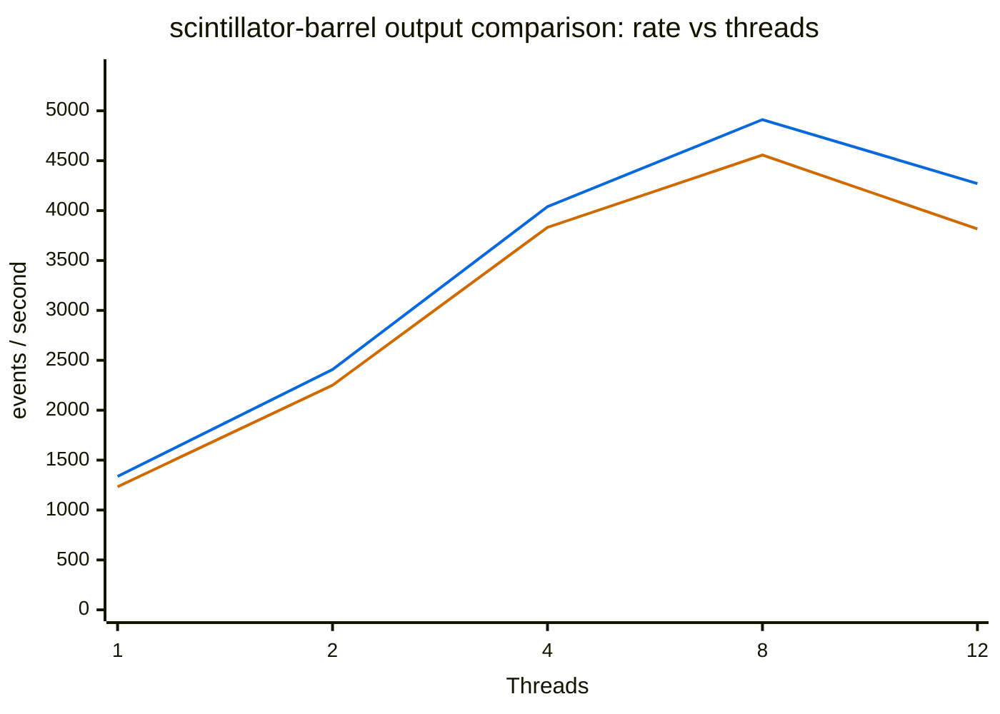

# Thread Scaling Results

## scintillator-barrel: no output

Runner configurations:

- 1 measurement job: Apple M2 Max; darwin 25.6.0; arm64; 12 visible CPUs; affinity unavailable

| Threads | Median time | Std. dev. | Speedup | Efficiency | Effective serial | Median rate | Samples |
|---:|---:|---:|---:|---:|---:|---:|---:|
| 1 | 14.954 s | 0.043 s | 1.00x | 100.0% | — | 1337.39 events/s | 4 |
| 2 | 8.307 s | 0.034 s | 1.80x | 90.0% | 11.1% | 2407.71 events/s | 4 |
| 4 | 4.951 s | 0.024 s | 3.02x | 75.5% | 10.8% | 4039.67 events/s | 4 |
| 8 | 4.072 s | 0.081 s | 3.67x | 45.9% | 16.8% | 4911.72 events/s | 4 |
| 12 | 4.683 s | 0.077 s | 3.19x | 26.6% | 25.1% | 4270.64 events/s | 4 |

> **Effective serial fraction:** Lower is better. This Amdahl/Karp–Flatt estimate approximates
> how much of the application's execution behaves serially. It also includes parallel overhead and
> contention, so it is not a literal percentage of source code.
> Negative values can result from superlinear scaling or measurement noise.

Per-replica sweeps (1)

| Replica | Runner | Threads | Median time | Speedup | Effective serial | Median rate |
|---:|:---|---:|---:|---:|---:|---:|
| 1 | Apple M2 Max; darwin 25.6.0; arm64; 12 visible CPUs; affinity unavailable | 1 | 14.954 s | 1.00x | — | 1337.39 events/s |
|  |  | 2 | 8.307 s | 1.80x | 11.1% | 2407.71 events/s |
|  |  | 4 | 4.951 s | 3.02x | 10.8% | 4039.67 events/s |
|  |  | 8 | 4.072 s | 3.67x | 16.8% | 4911.72 events/s |
|  |  | 12 | 4.683 s | 3.19x | 25.1% | 4270.64 events/s |

## scintillator-barrel: ROOT output

Runner configurations:

- 1 measurement job: Apple M2 Max; darwin 25.6.0; arm64; 12 visible CPUs; affinity unavailable

| Threads | Median time | Std. dev. | Speedup | Efficiency | Effective serial | Median rate | Samples |
|---:|---:|---:|---:|---:|---:|---:|---:|
| 1 | 16.212 s | 0.062 s | 1.00x | 100.0% | — | 1233.62 events/s | 4 |
| 2 | 8.888 s | 0.040 s | 1.82x | 91.2% | 9.6% | 2250.23 events/s | 4 |
| 4 | 5.219 s | 0.003 s | 3.11x | 77.7% | 9.6% | 3832.11 events/s | 4 |
| 8 | 4.389 s | 0.050 s | 3.69x | 46.2% | 16.7% | 4556.38 events/s | 4 |
| 12 | 5.241 s | 0.066 s | 3.09x | 25.8% | 26.2% | 3816.14 events/s | 4 |

> **Effective serial fraction:** Lower is better. This Amdahl/Karp–Flatt estimate approximates
> how much of the application's execution behaves serially. It also includes parallel overhead and
> contention, so it is not a literal percentage of source code.
> Negative values can result from superlinear scaling or measurement noise.

Per-replica sweeps (1)

| Replica | Runner | Threads | Median time | Speedup | Effective serial | Median rate |
|---:|:---|---:|---:|---:|---:|---:|
| 1 | Apple M2 Max; darwin 25.6.0; arm64; 12 visible CPUs; affinity unavailable | 1 | 16.212 s | 1.00x | — | 1233.62 events/s |
|  |  | 2 | 8.888 s | 1.82x | 9.6% | 2250.23 events/s |
|  |  | 4 | 5.219 s | 3.11x | 9.6% | 3832.11 events/s |
|  |  | 8 | 4.389 s | 3.69x | 16.7% | 4556.38 events/s |
|  |  | 12 | 5.241 s | 3.09x | 26.2% | 3816.14 events/s |

## scintillator-barrel output comparison

### Rate vs threads

**Series:** 🔵 No output · 🟠 ROOT output

**🔵 No output:** `1 thread: 1.34e+3 events/s` · `2 threads: 2.41e+3 events/s` · `4 threads: 4.04e+3 events/s` · `8 threads: 4.91e+3 events/s` · `12 threads: 4.27e+3 events/s`
**🟠 ROOT output:** `1 thread: 1.23e+3 events/s` · `2 threads: 2.25e+3 events/s` · `4 threads: 3.83e+3 events/s` · `8 threads: 4.56e+3 events/s` · `12 threads: 3.82e+3 events/s`

> For publication-quality results, use an otherwise idle machine with stable CPU placement and frequency.

